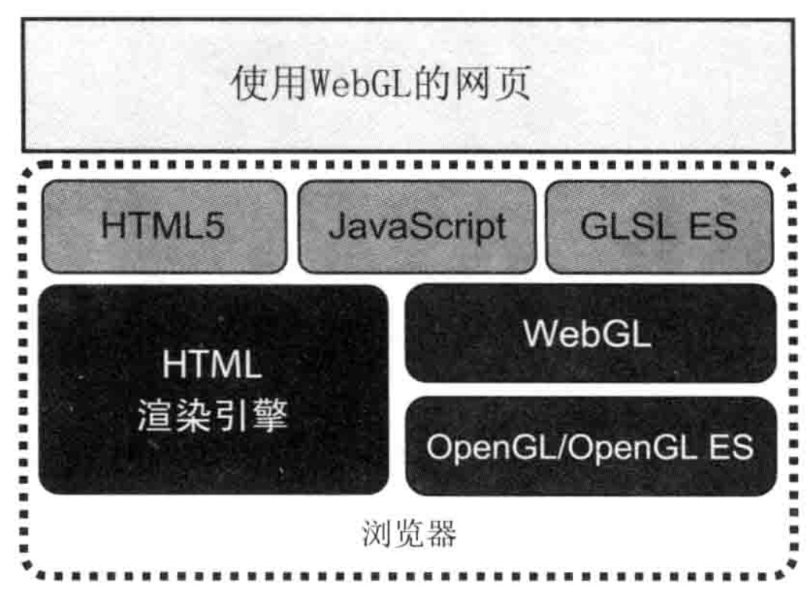

# WebGL 概述

## WebGL 的起源

目前最为广泛使用的三维图形渲染技术有 `Driect3D` 和 `OpenGL`。

`Driect3D` 是微软 `DriectX` 技术的一部分，是一套由微软控制的 API，主要用在 Windows 平台；

`OpenGL` 由于其开放的特性，在多种平台上都有广泛的使用：它可以在 Mac 和 Linux 系统的计算机、移动设备、家用游戏机等各种电子产品上使用。Windows 也对 `OpenGL` 有着良好的支持，开发者可以用它来代替 `Driect3D`。

`OpenGL` 最初由 SGI（Silicon Graphics Inc）开发，1992 年发布为开源标准。当前 OpenGL 桌面版的最新版本是 4.6，可在[官网](https://www.khronos.org/registry/OpenGL/index_gl.php)查询。

`WebGL` 是从 `OpenGL` 的一个特殊版本 `OpenGL SE` 中派生出来的。`OpenGL SE` 专用于嵌入式计算机、智能手机等设备。`OpenGL` 于 2003~2004 年被首次提出，并在 2007 年（SE 2.0）和 2012 年（SE 3.0） 进行两次升级。__WebGL 就是基于 OpenGL SE 2.0 的__。它在添加新特性的同时，从 `OpenGL` 中去除了许多陈旧的无用的旧特性，使它保持轻量级的同时仍具备渲染精美三维图形的能力，这也是许多智能手机、平板电脑等移动设备使用 `WebGL` 的原因。

下图展示了 OpenGL、OpenGL SE 1.1/2.0/3.0 和 WebGL 的关系。

从 2.0 版本开始，OpenGL 支持了一个很重要的特性，即 __可编程着色器方法__。

__着色器__ 使用一种类似于 C 的编程语言，称之为 __着色器语言（shading language）__，OpenGL SE 2.0 基于 __OpenGL 着色器语言__（GLSL），因此它被成为 __OpenGL SE 着色器语言__（GLSL SE）。 `WebGL` 基于 `OpenGL SE 2.0` 所以它也是使用 __GLSL SE__ 编写着色器。

## WebGL 程序的结构

WebGL 页面包含了三种语言：`HTML5`、`JavaScript` 和 `GLSL SE`。

着色器代码 GLSL SE 是内嵌在 JavaScript 中的，所以 WebGL 网页的文件结构和传统网页一样。