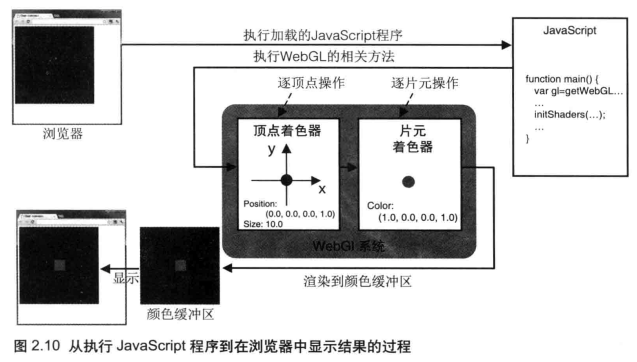

## 最短的 WebGL 程序：清空绘图区
### HTML 文件
``` Html
<!DOCTYPE html>
<html lang="cn">
    <head>
        <meta charset="utf-8" />
        <title>清空绘图区</title>
    </head>
    <body onload="main()">
        <canvas id="webgl" width="400" height="400">
        </canvas>
        <script src="js/HelloCanvas.js"></script>
    </body>
</html>
```

### JavaScript 程序（HelloCanvas.js）


```javascript
function main() {
    var canvas = document.getElementById('webgl');
    var gl = canvas.getContext('webgl');
    gl.clearColor(0.0, 0.0, 0.0, 1.0);
    gl.clear(gl.COLOR_BUFFER_BIT);
}
```

### 设置背景色
```javascript
gl.clearColor(0.0, 0.0, 0.0, 1.0);
```
一旦指定了背景色之后，背景色就会驻留在 __WebGL 系统（WebGL System）__ 中，在下一次调用 `gl.clearColor()` 方法前不会改变。换句话说，如果将来还想用同一个颜色再清空一次绘图区，没必要再指定一次背景色。

### 清空 \<canvas>
```javascript
gl.clear(gl.COLOR_BUFFER_BIT);
```
清空绘图区域，实际上是清空颜色缓冲区（color buffer），传递参数 `gl.COLOR_BUFFER_BIT` 就是告诉 WebGL 清空颜色缓冲区。除了颜色缓冲区，WebGL 还会使用其它种类的缓冲区，比如深度缓冲区和模板缓冲区。

## 绘制一个点（版本1）

```javascript
// 顶点着色器
var VSHADER_SOURCE = 
  'void main() {\n' +
  '  gl_Position = vec4(0.0, 0.0, 0.0, 1.0);\n' + // Set the vertex coordinates of the point
  '  gl_PointSize = 10.0;\n' +                    // Set the point size
  '}\n';

// 片元着色器
var FSHADER_SOURCE =
  'void main() {\n' +
  '  gl_FragColor = vec4(1.0, 0.0, 0.0, 1.0);\n' + // Set the point color
  '}\n';


function main() {
    var canvas = document.getElementById('webgl');
    var gl = canvas.getContext('webgl');
    if (!gl) {
        console.log('Failed to get the rendering context for WebGL');
        return;
    }

    // 创建顶点着色器对象
    var vertexShader = gl.createShader(gl.VERTEX_SHADER);
    if (vertexShader == null) {
        console.log('unable to create shader');
        return null;
    }
    // 设置着色程序
    gl.shaderSource(vertexShader, VSHADER_SOURCE);
    // 编译着色器
    gl.compileShader(vertexShader);
    // 检查编译的结果
    var compiled = gl.getShaderParameter(vertexShader, gl.COMPILE_STATUS);
    if (!compiled) {
        var error = gl.getShaderInfoLog(vertexShader);
        console.log('Failed to compile shader: ' + error);
        gl.deleteShader(vertexShader);
        return null;
    }

    // 创建片元着色器对象
    var fragmentShader = gl.createShader(gl.FRAGMENT_SHADER);
    // 设置着色程序
    gl.shaderSource(fragmentShader, FSHADER_SOURCE);
    // 编译着色器
    gl.compileShader(fragmentShader);
    // 检查编译的结果
    var compiled = gl.getShaderParameter(fragmentShader, gl.COMPILE_STATUS);
    if (!compiled) {
        var error = gl.getShaderInfoLog(fragmentShader);
        console.log('Failed to compile shader: ' + error);
        gl.deleteShader(fragmentShader);
        return null;
    }

    // 创建程序对象
    var program = gl.createProgram();
    if (!program) {
        return null;
    }

    // 附加着色器对象
    gl.attachShader(program, vertexShader);
    gl.attachShader(program, fragmentShader);

    // 链接程序对象
    gl.linkProgram(program);

    // 检查链接的结果
    var linked = gl.getProgramParameter(program, gl.LINK_STATUS);
    if (!linked) {
        var error = gl.getProgramInfoLog(program);
        console.log('Failed to link program: ' + error);
        gl.deleteProgram(program);
        gl.deleteShader(fragmentShader);
        gl.deleteShader(vertexShader);
        return null;
    }

    // 使用程序对象
    gl.useProgram(program);
    gl.program = program;

    gl.clearColor(0.0, 0.0, 0.0, 1.0);
    gl.clear(gl.COLOR_BUFFER_BIT);

    gl.drawArrays(gl.POINTS, 0, 1);
}
```

### 着色器是什么
用 __WebGL__ 绘图就必须使用着色器。在代码中，着色器程序是以字符串的形式“嵌入”在 JavaScript 文件中的，在程序真正开始运行前它就已经设置好了。

* __顶点着色器（Vertex shader）:__ 顶点着色器是用来描述顶点特性（如位置、颜色等）的程序。__顶点（Vertex）__ 是指二维或三维空间中的一个点。

* __片元着色器（Fragment shader）:__ 进行逐片元处理过程如光照的程序。__片元__ （fragment）是一个 __WebGL__ 术语，你可以将其理解为像素（图像的单元）。



齐次坐标使用如下的符号描述: (x, y, z, w),齐次坐标(x, y, z, w)等价于三维坐标(x/w, y/w, z/w)所以如果齐次坐标的第4个分量是1,你就可以将它当做三维坐标来使用。w的值必须是大于等于0的。如果w趋近于0,那么它所表示的点将趋近无穷远,所以在齐次坐标系中可以有无穷的概念。齐次坐标的存在,使得用矩阵乘法来描述顶点变换成为可能,三维图形系统在计算过程中,通常使用齐次坐标来表示顶点的三维坐标。